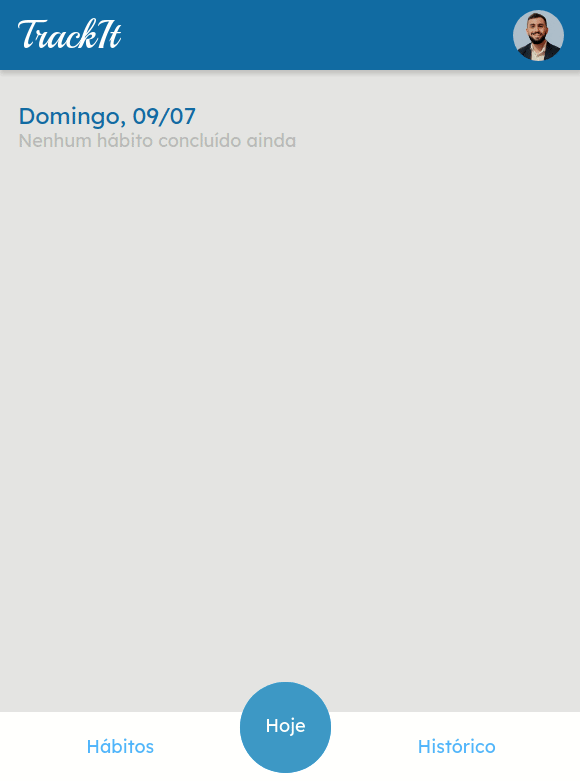

## TrackIt 🔗 
<p align="center">
 
</p>

## About :memo:
A habits tracking app written in React that allows you to improve your discipline!

## Deployment 🚀

<a href="https://linkr-front-beige.vercel.app/">https://projeto-track-heomxlrj4-gaabrielmooreira.vercel.app/</a>
</br>

## Features ✨

- Register & Authentication
- Create a new habit with the days
- Today habits, check habits that you made
 
</br>

## Stack :toolbox:

<div align="left">
  
  
  
</div>

## How to run ▶️
```bash
# Clone this repository
$ git clone <https://github.com/gaabrielmooreira/track-it.git>
# Access the project folder cmd/terminal
$ cd track-it
# Install the dependencies
$ npm install
# Compile the code
$ npm run build
# Run the application 
$ npm start
# The server will automatically start at localhost:3000/ on your favorite browser 
```
